# Setting up SQL Server 2019 AlwaysOn Availability Group Clusters on a multi-subnet network with a domain

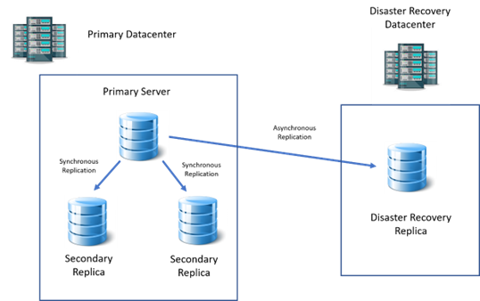

| 02/23/2023 |
| ---------- |

Last updated:

| 01/13/2025 |
| ---------- |

## Foreword:

* Sometimes you might need to setup a cluster which spans
  multiple subnets and separate vLans. The nodes on this cluster need to
  communicate using intermediary routing devices. A single datacenter can have multiple
  subnets. Multi-subnet AlwaysOn cluster is recommended for replicas that are
  situated in the same datacenter with strong and stable network connection.

  However, please note that if your multi-subnet cluster should span over a cross-datacenter architecture with separate geolocations for disaster recovery purposes, a “Distributed Availability Group (DAG)” is a better solution and have some advantages over traditional AlwaysOn cluster.
* Also, as another remedy, you can create a virtual network on
  top of a physically separated LANs using SDN solutions with only one subnet.
  This way, the AlwaysOn cluster can be created on an ordinary single subnet network.

## Preliminaries and Prerequisites:

* This document uses Windows Server 2019, and SQL Server 2019. Later, I tested it on Windows Server 2025 and
  SQL Server 2022
* This document assumes that
  you have full control over your domain, servers, and network. If you do not,
  you have to refer to respective infrastructure teams for your environment.
* The full process for
  creating SQL Server Availability Group are not explained here, and only the
  difference between single-subnet and multi-subnet Availability Groups setup is
  mentioned. For single-subnet details please refer to the online materials.

**This test case specific IP addresses:**

Suppose that the following IP addresses belong to the DC,
Node1, Node2, and disaster (secondary subnet) node respectively:

| DC: 192.168.241.240 |
| ------------------- |

| Node1: 192.168.241.111 |
| ---------------------- |

| Node2: 192.168.241.112 |
| ---------------------- |

Secondary subnet Node:

| Node3: 10.10.10.113 |
| ------------------- |

Cluster IP addresses:

| 192.168.241.114 & 10.10.10.114 |
| ------------------------------ |

Listener IP addresses:

| 192.168.241.115 & 10.10.10.115 |
| ------------------------------ |

Router (Gateways between subnets) IP addresses:

| 192.168.241.2 & 10.10.10.1 |
| -------------------------- |

## **Port Requirements:**

Aside from mandatory TCP ports for SQL Server service (1433
and 1434 for default instance) and endpoints (which is usually 5022) the port
3343 is required for the cluster. You need to make sure that it is visible to
every node from every other node.

Note that no extra services or applications are installed on
these VMs except OpenSSH (which is not mandatory) and only necessary
applications have been installed from raw windows server installation.

Here is a list of open listening TCP ports on my nodes that
are not present on a Raw Windows Server 2019 Computer on a domain:

Having these extra ports are recommended when setting up the
Availability Group Cluster

5357 is **Web Services on Devices (WSD) API** in Windows

5985 is WinRM and PowerShell remoting port over HTTP

9389 is Active Directory Web Services (ADWS)

## **List of test case open listening ports in detail**

Here is a major list of listening ports (apart from dynamic
ports) in my test case on my different servers.

| DC: |
| --- |

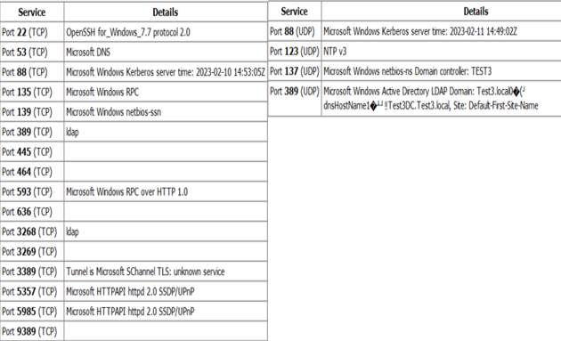

 Simple raw windows server ports:

For the 5985 or 5986 ports to be listening on, PowerShell
Remoting feature over HTTP or HTTPS must be enabled.

The UDP ports serve the same subnet.

The “intersect” of Node1 and Node2 and Node3 listening TCP
ports is as follows:

Note that port 22 is for OpenSSH and is NOT mandatory
and 5022 is the port that I chose for SQL Server endpoints.

If you have malfunctions in your cluster/AG, you can use a
port scanner software to scan your server’s ports to see which ports are active
and responding.

## **Joining a different subnet Server to the domain:**

Make sure that your DNS and
Active Directory service have the required configurations. A sample of the DNS
Server's IP configuration can be the following:

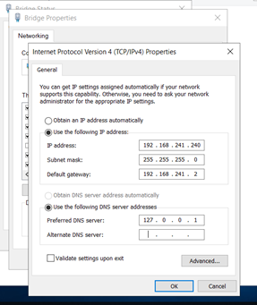

The gateway must be a router’s IP on your Local Area Network which
routes your server to the second subnet.

Go to the DNS Manager.

Right-click on the “Reverse
Lookup Zones” and click on “New Zone”

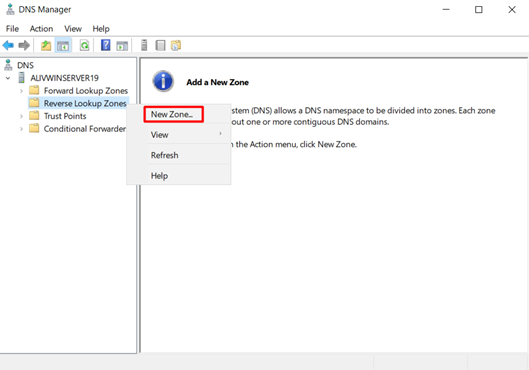

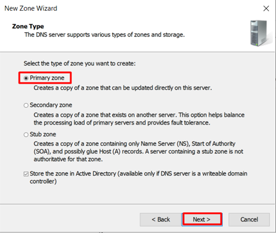

5. The options are
   self-expressive. The default is the second radio button but I prefer the first
   one

   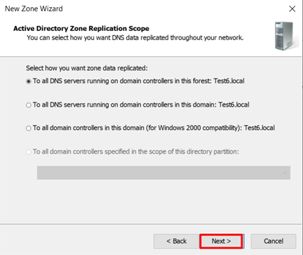
6. Choose the second subnet IP
   version and click next

   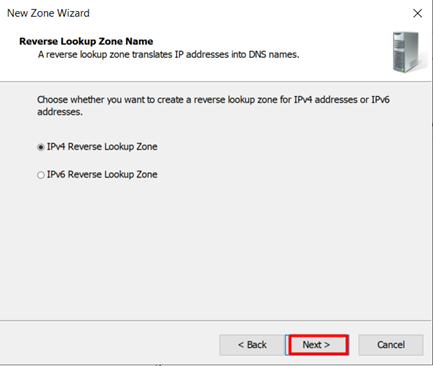
7. Enter “Network ID” and click next

   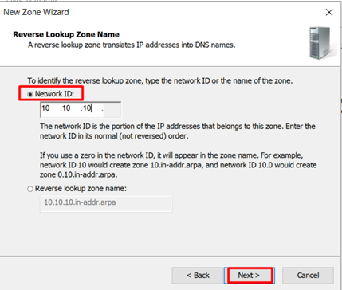
8. .

   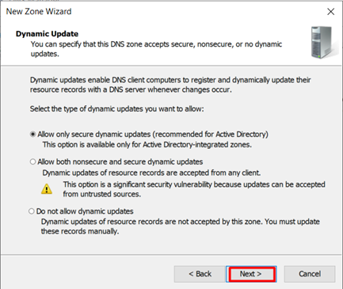
9. .

   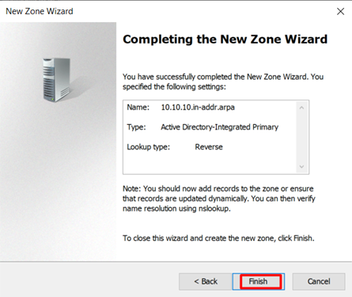

   
10. Sample IPv4 address
    configuration on 2 of the nodes (DNS server specification is important for
    joining the domain process to find the domain controller):

    

a. Same subnet:

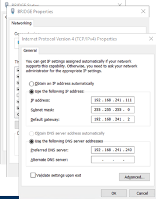

b. Secondary subnet:

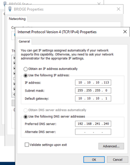

11. .

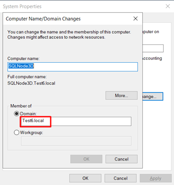

**Summary for adding a secondary subnet server to the domain:**

Joining Servers that are on the same subnet as the domain
controller is easy and non-problematic. But as for a multi-subnet network, it
becomes a bit tricky. There are 2 requirements:

* You must manually add the
  secondary subnet reverse zones to the DNS server.
* For either of the same
  subnet or secondary subnet servers to be able to resolve the domain name when
  trying to join the domain, you have to obviously define a DNS server on the
  server which is trying to join the domain, which can resolve the domain name.
  This DNS server is usually setup on the domain controller itself.
* If you get an error when
  trying to join the VMs to the domain that the specified domain cannot be
  contacted, some issues including DNS server problems might be the reason
  including the following:

a.
You have not set the DNS
server in the SQL VMs interface configurations.

b.
Try to enter the “Root
domain name” or “fully qualified domain name” as well. Netbios might not work
if it is not defined in the DNS server.

* If you get a SID error
  similar to this when trying to join your server to the domain, you have improperly
  cloned your VM. To resolve this, you have to run “Sysprep” on your VM. For
  information on how to do so, refer to online materials.

## Setting up multi-subnet SQL Server 2019 AlwaysOn HA:

## Brief steps:

| **192.168.241.111** |
| ------------------------- |

| **192.168.241.112** |
| ------------------------- |

| **10.10.10.113** |
| ---------------------- |

3. .

   
4. .

   
5. .

   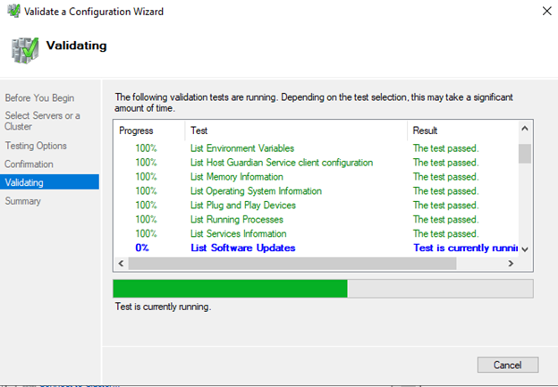
6. .

   

A warning shows up:

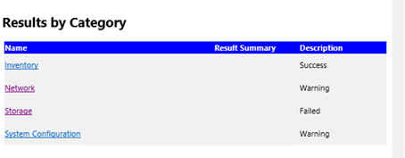

Storage validation is unimportant to us right now.

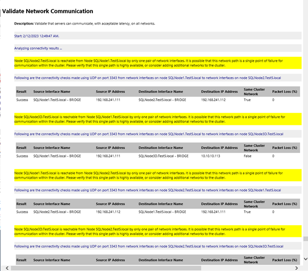

This warning strongly recommends that the
link between our nodes is highly available and fault tolerant. We disregard it
for our test case.

7. .

   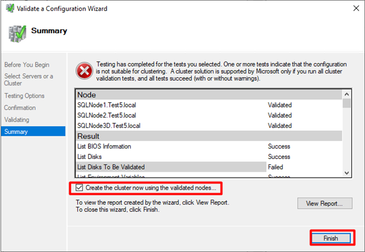
8. Entering cluster IP addresses for both subnets. Windows server failover cluster’s “Create Cluster Wizard”
   automatically detects that your cluster is multi-subnet based on the nodes you
   have added.

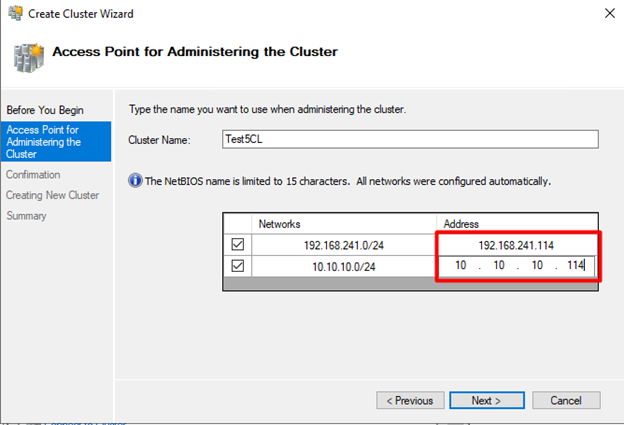

If multiple subnets exist, all the subnets will be listed
here.

9. .

   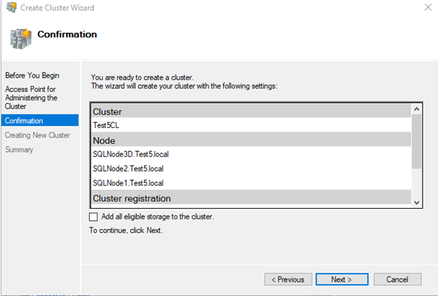
10. .

    

11. .

## Setting up the AlwaysOn Availability group role for the cluster:

1. .

   

2. .

2. In the “New Availability Group” wizard, listener IP addresses for both subnets should be
defined:

The rest of the configurations are very similar to single-subnet

Availability Group configurations.

* **Conclusion and notable points in contrast with the
  single-subnet Availability Group:**

After joining the secondary subnet servers to the domain,
the cluster and AlwaysOn AG can be created as normal with the following new
concepts:

When setting the IP for the
cluster, you have to set an IP for each subnet (Overall 2 IPs). The
functionality of these IPs has been explained in the “Some details about the
cluster and listener behaviors” section. As noted, only one of these two IP
addresses can be online at the same time in the cluster.

When setting up a listener
for the AG, you have to specify a listener IP for each subnet (Overall 2 IPs).
As noted, only one of these two IP addresses can be online at the same time in
the cluster.

# Appendix:

## 1. **Some details about ****the cluster and listener**** behaviors**

We know that the primary server holds the IP of the listener
on its interfaces, meaning that calling the listener’s IP address on the
network,  **results in the primary server responding** .

ipconfig on the primary server of our example:

| Listener: |
| --------- |

/1736794588382.png)

IP of the cluster will also be assigned to the interface of
one of the servers which is usually the primary server but not necessarily. This is an example of a same-subnet
secondary replica holding the cluster IP address:

| Cluster: |
| -------- |

/1736794690093.png)

The cluster and the listener in this cluster will have 2 IP
addresses each. When the primary server is on subnet 241, the secondary subnet
listener IP address will be offline:

/1736795622794.png)

After failover to the second subnet:

/1736795651979.png)

However, regarding the cluster, it is reluctant to change
its IP address and the host of its IP address by a mere failover. It is even
reluctant to switch to another subnet so long as a healthy node on the same
subnet of the current failing node exists. In our example the primary was at
first Node1, then Node3, but the cluster IP address remained on Node2. It was
on Node2 due to earlier circumstances.

But when all the nodes on the primary subnet failed, the
cluster IP address also switched to the second subnet:

/1736795688921.png)

/1736795697520.png)

Note that obviously both cluster and listener can only be
online on 1 subnet at the same time, i.e. when they are online on one subnet,
they will be offline on the other one. So, in order for the secondary subnet
node to serve the application, either an IP forwarding service must redirect
the requests to 192.168.241.115 to 10.10.10.115, or the application connection
string must point to this new listener IP address with a different subnet.

When Node1 and Node2 failed and the AG automatically failed over to Node3:

/1736795744514.png)

The interface of Node3 has 3 IP addresses above.

## 2. Testing the Availability Group:

Logically there will be no difference between any of the
nodes in this cluster in terms of being primary, synchronous, asynchronous,
automatic failover, etc.

| Secondary subnet Node: |
| ---------------------- |

/1736795855762.png)

All failover scenarios were tested. (Automatic failover,
manual failover, manual forced failover to the secondary subnet node, etc.)

END  
